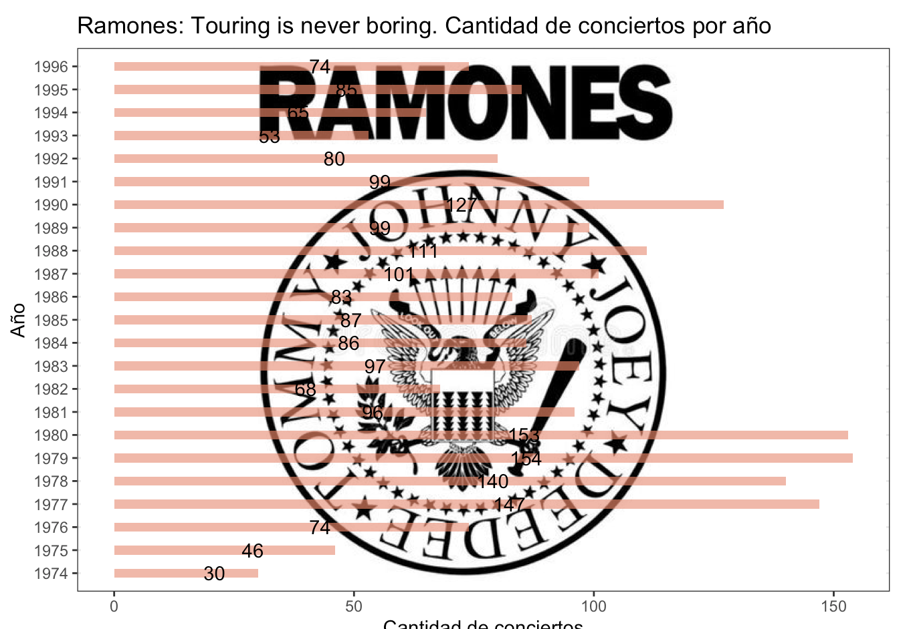

  

<h1 align="center">🎸 Ramones | Web Scraping & Análisis en R</h1>

<h2>📌 Resumen</h2>

El siguiente trabajo realiza un análisis de <strong>Web Scraping</strong> con el objetivo de recopilar información sobre las fechas de conciertos de la banda <strong>Ramones</strong> durante toda su carrera y luego crear un gráfico para visualizar la cantidad de conciertos por año.

El desafío principal fue la consolidación de la información en formato tabular al extraerla de una página como <strong>Wikipedia</strong>, la cual puede contener varios formatos y un código URL difícil de sistematizar para el scraping de los datos.

<h2>🛠️ Skills Técnicas</h2>

<ul>
  <li><strong>Web Scraping:</strong> uso de la librería <code>rvest</code> para extraer información desde Wikipedia sobre las giras musicales de Ramones.</li>
  <li><strong>Manipulación de Datos:</strong> uso de <code>dplyr</code> y <code>tidyr</code> para transformar y estructurar los datos extraídos.</li>
  <li><strong>Limpieza de Datos:</strong> eliminación de información irrelevante y corrección de errores e inconsistencias generadas durante la extracción.</li>
  <li><strong>Unión de Datos:</strong> combinación de múltiples tablas extraídas para construir una tabla unificada.</li>
  <li><strong>Visualización de Datos:</strong> uso de <code>ggplot2</code> para crear un gráfico de barras con la cantidad de conciertos por año.</li>
  <li><strong>Personalización de Gráficos:</strong> incorporación de un logo y ajustes de colores y disposición de elementos.</li>
</ul>

<h2>📚 Librerías Utilizadas</h2>

<ul>
  <li><code>rvest</code> (web scraping)</li>
  <li><code>dplyr</code> y <code>tidyr</code> (manipulación de datos)</li>
  <li><code>ggplot2</code> (visualización de datos)</li>
  <li><code>lubridate</code> (manejo de fechas)</li>
  <li><code>grid</code> (personalización del gráfico)</li>
</ul>
